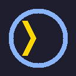

<p align="center">
  
</p>

<h1 align="center">GitStorm</h1>

<p align="center">
  IntelliJ/PhpStorm-style Git management for VS Code.
</p>

<p align="center">
  
  
  
</p>

GitStorm brings a JetBrains-like Git workflow to Visual Studio Code: a focused Commit panel, a Git Log panel with graph and branch operations, multi-repository awareness, shelving/stashing tools, push helpers, and a 3-way merge editor for conflict resolution.

It activates automatically when the opened workspace contains a Git repository.

## Features

- **Commit panel** with staged/unstaged files, tree and flat views, per-file diffs, rollback, delete, open file, add to `.gitignore`, and selected-file commits.
- **Multi-repository workspaces** with per-project colors, grouped changes, shared commit flow, and common branch actions across repositories.
- **Git Log panel** with commit graph, branch sidebar, filters by text, author, branch, date, and repository, plus commit details and changed-file diffs.
- **Branch operations** for checkout, fetch, pull, push, merge, rebase, delete, rename, compare, and creating new branches.
- **Commit actions** for commit, amend, commit and push, and optional AI commit-message generation through the VS Code Language Model API / GitHub Copilot.
- **Shelve support** with patch-based shelves, partial unshelve, file diffs, binary-file handling, and conflict detection.
- **Native stash support** with list, apply, pop, drop, and file diff preview.
- **Push view** showing unpushed commits for repositories with upstream changes.
- **Merge editor** for conflict-marker files with side-by-side conflict panes, editable result, conflict navigation, save, and automatic staging.
- **Status bar branch menu** showing dirty, ahead, behind, and diverged repository states, with quick access to update, push, commit, branch, and log workflows.
- **Activity bar badge** showing the number of changed files.

## Requirements

- Visual Studio Code `1.85.0` or newer.
- Git installed and available in the workspace.
- Node.js `18` or newer and npm for development or packaging.

GitStorm uses VS Code's built-in Git extension when available and falls back to direct Git operations through `simple-git`.

## Installation

### From a VSIX

Build and package the extension:

```bash
npm install
npm run build
npm run package
```

Then install the generated `.vsix`:

```bash
code --install-extension gitstorm-0.1.0.vsix
```

### Development Host

Install dependencies, build once, then launch the extension host from VS Code:

```bash
npm install
npm run build
```

Open this repository in VS Code and run **Run Extension** from the Debug panel.

For iterative development:

```bash
npm run watch
```

## Usage

Open a workspace that contains one or more Git repositories. GitStorm adds:

- **GitStorm Commit** in the Activity Bar.
- **GitStorm Log** in the bottom Panel.
- A **GitStorm branch item** in the Status Bar.
- Commands in the Command Palette.

Use the Commit panel to select files, inspect diffs, write a commit message, commit, commit and push, shelve changes, manage stashes, or review unpushed commits.

Use the Log panel to browse history, filter commits, inspect changed files, open diffs, and run branch or commit operations.

Use the Status Bar branch menu for fast project-wide actions such as updating all repositories, pushing, creating branches, switching common branches, or handling merge/rebase states.

## Commands

| Command | Description |
|:--|:--|
| `GitStorm: Focus Git Log` | Focuses the Git Log panel. |
| `GitStorm: Fetch All Remotes` | Fetches and prunes remotes. |
| `GitStorm: Open Merge Editor` | Opens the merge editor for the active file when conflict markers are present. |
| `GitStorm: Refresh Commit Panel` | Refreshes the Commit panel state. |
| `GitStorm: Branch Menu` | Opens the Status Bar branch menu. |
| `GitStorm: Update Project` | Pulls all repositories using merge or rebase. |
| `GitStorm: Settings` | Opens GitStorm settings. |

Commit, commit and push, pull, push, stash, shelve, and reset workflows are available from the GitStorm panels and the branch menu.

## Keybindings

| Keybinding | macOS | Command |
|:--|:--|:--|
| `Ctrl+Alt+L` | `Cmd+Alt+L` | `GitStorm: Focus Git Log` |

## Settings

| Setting | Default | Description |
|:--|:--|:--|
| `gitstorm.graphMaxCommits` | `1000` | Maximum number of commits loaded into the Git Log graph. |
| `gitstorm.fetchOnStartup` | `false` | Fetches all remotes when GitStorm activates. |
| `gitstorm.projectColors` | `{}` | Maps workspace folder names to hex colors for multi-repo views. |
| `gitstorm.autoRefreshInterval` | `0` | Auto-refresh interval in seconds. `0` disables interval refresh and uses watchers. |

Example:

```json
{
  "gitstorm.fetchOnStartup": true,
  "gitstorm.graphMaxCommits": 2000,
  "gitstorm.projectColors": {
    "api": "#ff6b6b",
    "web": "#4ec9b0"
  }
}
```

## Project Structure

```text
src/host/                 VS Code extension host code
src/host/git/             Git, diff, conflict, workspace, and shelve services
src/host/panels/          Webview providers for Commit, Log, and Merge Editor
src/host/ui/              Status bar and activity badge controllers
src/webview/commitPanel/  React Commit panel
src/webview/gitLog/       React Git Log panel
src/webview/mergeEditor/  React 3-way merge editor
src/webview/shared/       Shared webview components, hooks, and message types
media/                    Extension icons, codicons, and assets
out/                      Built extension and webview bundles
```

## Development Scripts

| Script | Description |
|:--|:--|
| `npm run build` | Builds both extension host and webview bundles. |
| `npm run build:host` | Builds the extension host bundle with esbuild. |
| `npm run build:webview` | Builds all React webview bundles. |
| `npm run watch` | Watches host and webview sources in parallel. |
| `npm run lint` | Runs ESLint on TypeScript and TSX sources. |
| `npm run typecheck` | Type-checks the main TypeScript project. |
| `npm run typecheck:webview` | Type-checks the webview TypeScript project. |
| `npm run package` | Creates a VSIX package with `vsce`. |
| `npm run publish` | Publishes the extension with `vsce publish`. |

## Notes

- GitStorm is designed for Git workspaces and multi-root workspaces where each folder may be its own repository.
- Destructive operations such as rollback, delete, branch delete, reset, stash drop, and shelve drop ask for confirmation.
- AI commit-message generation requires an available VS Code language model, such as GitHub Copilot.
- The merge editor works on files that contain Git conflict markers.

## License

This project is distributed under the MIT license.
